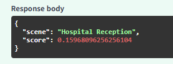

# AAC Scene Recognition AI

Meta Glass에서 촬영한 이미지를 CLIP 모델로 분석하여 현재 사용자가 처한 **상황(Scene)** 을 분류하는 AI 서버입니다.

현재는 **OpenCLIP Baseline 모델**을 사용하고 있으며, 추후 Meta Glass 환경에 맞는 데이터셋으로 **CLIP Fine-tuning**을 진행할 예정입니다.

> 현재 진행 단계 : **Baseline CLIP + FastAPI 구축 완료 / 데이터셋 수집 진행 중**

---

# 프로젝트 목표

Meta Glass에서 촬영한 이미지를 분석하여 사용자가 처한 상황(Scene)을 인식하고, 해당 상황에 맞는 AAC 카드를 추천하기 위한 AI 모델을 개발합니다.

---

# 시스템 구조

```
Meta Glass
      │
      ▼
이미지 촬영
      │
      ▼
FastAPI 서버
      │
      ▼
CLIP 모델
      │
      ▼
Scene 분류
      │
      ▼
AAC 추천
```

---

# 프로젝트 구조

```
back
│
├── api
│   └── main.py              # FastAPI 서버
│
├── services
│   └── inference.py         # 추론 로직
│
├── models
│   └── clip.py              # CLIP 모델
│
├── train
│   ├── train.py             # 모델 학습
│   ├── dataset.py           # Dataset Loader
│   └── evaluate.py          # 모델 평가
│
├── configs
│   └── config.py            # 학습 설정
│
├── data                     # 데이터셋
│
├── requirements.txt
└── README.md
```

---


# 현재 Scene Class

- Hospital Reception
- Pharmacy Counter
- Cafe Counter
- Restaurant Counter
- Convenience Store Counter
- Bus Entrance
- Subway Gate

※ 추후 필요 시 클래스 추가 예정

---

# API

### GET /

서버 실행 여부를 확인합니다.

Response

```json
{
  "message": "AAC CLIP API"
}
```

---

### POST /predict

이미지 1장을 입력받아 현재 Scene을 예측합니다.

**입력**

- image (jpg, png)

**출력**

```json
{
  "scene": "Cafe Counter",
  "score": 0.93
}
```
## API 테스트



---

# 실행 방법

### 패키지 설치

```bash
pip install -r requirements.txt
```

### 서버 실행

```bash
uvicorn api.main:app --reload
```

### Swagger

```
http://127.0.0.1:8000/docs
```

---


# AI

- CLIP Fine-tuning
- Scene Recognition
- FastAPI
- Model Evaluation